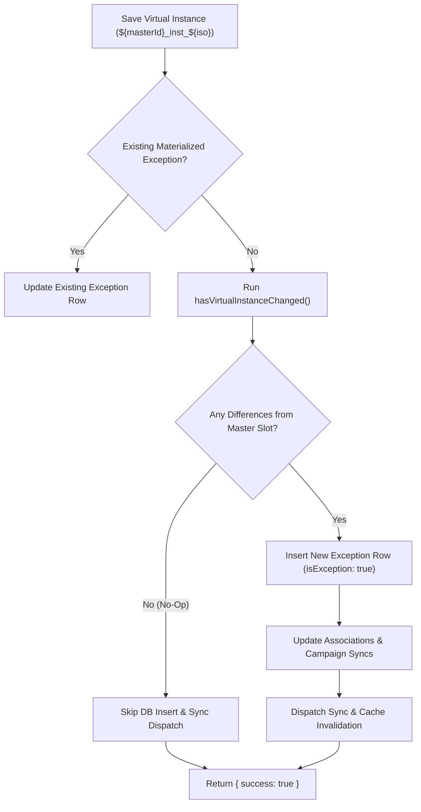

# Event Series & Recurring Events Architecture

This document describes the architectural design, lifecycle, and implementation details of recurring event series, virtual occurrences, exception handling, and no-op mutation protections in the application.

---

## 1. Architectural Overview & Design Goals

Recurring events adhere to the iCalendar standard ([RFC 5545](https://datatracker.ietf.org/doc/html/rfc5545)):
- **Master Events**: Contain the recurrence rule specification in the `recurrence` array (e.g., `["RRULE:FREQ=WEEKLY;BYDAY=MO,WE,FR"]`). The master record defines the schedule template, start time, duration, and default metadata.
- **Virtual Instances**: Occurrences projected dynamically along the recurrence timeline. They are **not** persisted as separate rows in PostgreSQL until customized.
- **Materialized Exceptions**: Individual occurrences that deviate from the master schedule (e.g., rescheduled, renamed, cancelled, or altered). Exceptions are persisted with a reference back to the master via `recurringEventId` and their original occurrence timestamp via `originalStartTime`.

### Benefits
1. **Zero Database Bloat**: A daily event that repeats indefinitely does not generate thousands of database rows.
2. **Dynamic Schedule Propagation**: Updating the master event (e.g., moving start time from 10:00 to 11:00) automatically propagates to all un-materialized virtual instances.
3. **Selective Overrides**: Modifying an individual occurrence detaches only that single slot as a localized exception while preserving the remainder of the series.

---

## 2. Virtual Instance Identification

Virtual instances do not exist as primary keys in the database. Instead, they are represented using a deterministic composite identifier:

```text
${masterId}_inst_${isoOccurrenceStartTime}
```

*Example:*  
`b72e5192-3bc1-4993-8419-7e3734e56ebc_inst_2026-10-15T14%3A00%3A00.000Z`

### Helper Utilities (`$lib/utils/event-series.ts`)
The utility module [event-series.ts](file:///c:/Users/bofru/src/AtCost/apps/multiposter/src/lib/utils/event-series.ts) provides standardized helpers for series logic:

| Helper | Description |
|---|---|
| `isSeriesMaster(event)` | Returns `true` if the event defines an active recurrence rule (`recurrence` array) and is not an exception. |
| `isVirtualInstanceId(id)` | Checks if a given ID string matches the virtual pattern containing `_inst_`. |
| `parseVirtualInstanceId(id)` | Splits the virtual ID into `{ masterId, iso }` or returns `null` if invalid. |
| `isSeriesInstance(event)` | Returns `true` if the event is a virtual instance, has `recurringEventId`, has `originalStartTime`, or has `isException: true`. |
| `getSeriesRootId(event)` | Resolves the root master UUID regardless of whether called on a master, a materialized exception, or a virtual instance. |

### PostgreSQL Type Safety Rule
> [!IMPORTANT]
> The PostgreSQL `event.id` column is typed as `uuid`. Querying `eq(event.id, virtualId)` will trigger a fatal database error (`22P02: invalid input syntax for type uuid`). Virtual IDs must always be decomposed with `parseVirtualInstanceId` before querying the database.

---

## 3. Reading and Querying Instances

### Occurrence Expansion (`list.remote.ts`)
When fetching events for list or calendar views:
1. Master events with recurrence rules are processed using the `rrule` library within the requested date window.
2. For each calculated occurrence date:
   - The server checks if a materialized exception exists for that date (`recurringEventId = master.id` and `originalStartTime->>'dateTime' = occurrenceIso`).
   - If an exception exists, the exception row is included in the list.
   - If no exception exists, a virtual instance is projected with `id: ${master.id}_inst_${occurrenceIso}`.

### Single Instance Retrieval (`read.remote.ts`)
When navigating to `/events/[id]` or `/events/[id]/view`:
1. If the ID is a UUID:
   - Fetches the record directly from the `event` table.
2. If the ID is a virtual ID (`masterId_inst_iso`):
   - Queries the database for an existing materialized exception matching `recurringEventId = masterId` and matching the ISO timestamp.
   - If found, returns the materialized exception.
   - If not found, fetches the master record and synthesizes the occurrence:
     - Sets `startDateTime` and `endDateTime` according to the occurrence ISO timestamp and master duration.
     - Inherits all master metadata, associations (locations, resources, contacts, tags), and campaign sync settings.
     - Sets `seriesId: master.id` and preserves the virtual string ID.

---

## 4. Editing & Updating Series Instances

When a user edits an event (`update.remote.ts`), the form provides a `seriesMode` selector with two options:

### Mode 1: Edit Entire Series (`seriesMode: 'series'`)
- The update targets the master event (`targetId = instMasterId`).
- Recurrence rules, general descriptions, and base schedules are updated on the master.
- All non-materialized virtual instances immediately reflect the updated master configuration.

### Mode 2: Edit Single Occurrence (`seriesMode: 'single'`)
- If the occurrence is already a materialized exception, the update modifies that existing exception row.
- If the occurrence is a virtual instance, the server must determine whether to materialize a new exception row in the database.

---

## 5. No-Op Exception Protection

### The Problem
In standard calendar workflows, users often open an individual occurrence in edit mode simply to inspect its details, and then leave by clicking **Save** without altering any values.

Without protection, naive backend handlers would insert a new database row with `isException: true`. This causes:
- **Database Bloat**: Unnecessary rows created for identical copies of the master event.
- **Broken Inheritance**: Once materialized as an exception, the occurrence is detached from future changes made to the master event series.
- **Unnecessary Overhead**: Redundant image generation, ICS recalculation, and external sync webhook triggers (Google Calendar, Microsoft Calendar).

### The Solution: Deep Diff Detection (`hasVirtualInstanceChanged`)
Before inserting an exception row into the database, [update.remote.ts](file:///c:/Users/bofru/src/AtCost/apps/multiposter/src/routes/events/[id]/update.remote.ts) runs [hasVirtualInstanceChanged()](file:///c:/Users/bofru/src/AtCost/apps/multiposter/src/lib/server/events/exceptions.ts).



### Fields Evaluated in the Diff
The helper compares the submitted payload against what the master event formulaically projects for that slot:
- **Schedule & Timing**: Start and end timestamps are compared against the calculated occurrence slot (with a 1-second tolerance for rounding).
- **Core Metadata**: `summary`, `description`, `internalNotes`, `status`, `categoryBerlinDotDe`, `heroImage`.
- **Pricing & Participants**: `ticketPrice`, `ticketPriceUnknown`, `participantsCount`.
- **Visibility & Permissions**: `isAllDay`, `isPublic`, `guestsCanModify`, `guestsCanInviteOthers`, `guestsCanSeeOtherGuests`.
- **Reminders**: Deep JSON equality check on reminder arrays.
- **Linked Associations**:
  - `locationIds`: Set comparison against master linked locations.
  - `resourceIds`: Set comparison against master linked resources.
  - `contactIds`: Set comparison against master linked contacts.
  - `tags`: Set comparison against master linked tags (excluding the auto-generated `'Series'` tag).
  - `syncIds`: Set comparison against master campaign sync targets.

### Result of No-Op
If all fields match the master projection, the transaction aborts the insert and returns:
```ts
{ success: true }
```
The virtual instance remains purely virtual, perfectly intact, and bound to the master's future updates.

---

## 6. Deletion Workflows

Deletion handlers support both single-occurrence and series-wide deletions:

1. **Delete Single Occurrence**:
   - Materialized exceptions are deleted or marked cancelled.
   - Virtual instances can be excluded by adding an `EXDATE` entry to the master's RRULE or by recording a cancelled exception row.
2. **Delete Entire Series**:
   - When deleting from a virtual or exception instance, the backend resolves `instMasterId` via `getSeriesRootId`.
   - Deleting the master cascades to delete all linked exceptions (`eq(event.recurringEventId, masterId)`) and cleans up the associated `campaign` and `recurringSeries` records.

---

## 7. Frontend Reactivity (Svelte 5 Runes)

When navigating between different occurrences of the same series (e.g. from `/events/uuid_inst_2026-10-01...` to `/events/uuid_inst_2026-10-08...`), SvelteKit reuses the page component.

To ensure pristine state resets and prevent stale form bindings:
- **Component Keying**: Views and forms are wrapped in `{#key event.id}` in both edit and read-only routes:
  ```svelte
  {#key event.id}
    <EventForm {event} {remoteFunction} ... />
  {/key}
  ```
- **Declarative Navigation**: Navigation uses `goto()` from `$app/navigation`, with parameters tracked via `$derived` runes from `$app/state` (`page.params.id`).
